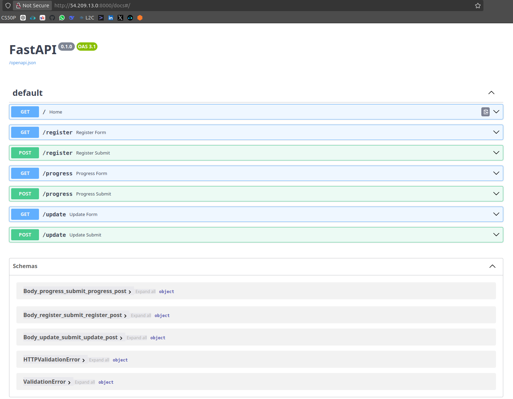
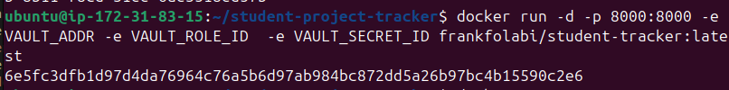
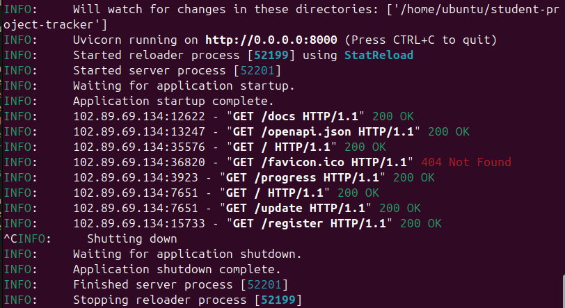
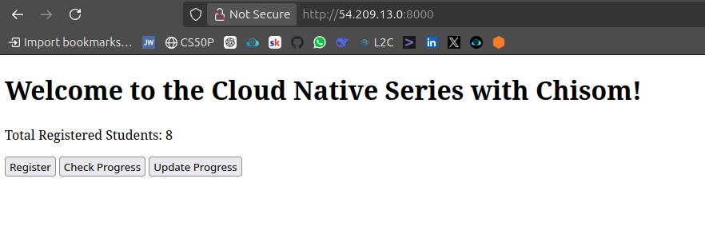
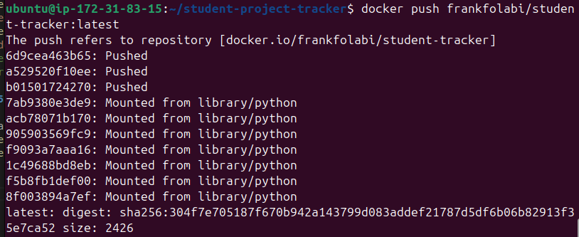
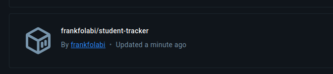

# 📦 Building my Student Tracker App

This FastAPI app allows students to register, track their weekly progress in the bootcamp, and view others' progress (using a shared MongoDB Atlas backend).

## 🚀 Goals Accomplished
Using a Dockerfile, 
- The app was containerized
- Ran the app inside Docker container
- Test the API on browser using the VM's public IP
- Pushed the image on DockerHub

---

## ✅ Prerequisites

VM already been set up from [1.1-Automate-your-Setup](https://github.com/frankfolabi/learn-cloud-native/tree/master/1.1-Automate-your-Setup):

The following packages have been installed:

- Docker  
- Git  
- Python 3 & Pip  
- Kubernetes tools (kubectl, kind)  
  

---

## 🧪 Step-by-Step Guide on the VM

### 1. Clone the Project

```bash
git clone https://github.com/ChisomJude/student-project-tracker.git
cd student-project-tracker
```

### 2. Connect to the vault Server

```
curl http://<vaultip>:8200/v1/sys/health
```

***A central db, vault token and IP was provided for the project.***
> You can create your vault for the project.


### 3. Run Locally 
To test the app locally before Dockerizing:

```bash
sudo apt update
sudo apt install python3-venv -y

python3 -m venv venv
source venv/bin/activate
pip install -r requirements.txt
uvicorn app.main:app --host 0.0.0.0 --port 8000 --reload

# Go to: http://<your-VM-public-IP>:8000/docs. 
# Ensure port 8000 is open in the network security group, and confirm it works.
```


### 4. Build your image
A Dockerfile is already provided in the project repo.
 
✅ Build the image 
<br> ✅ Run the container locally <br>
✅ Push to DckerHub 


```bash
docker build -t yourdockerhubusername/student-tracker:latest .
docker run -d -p 8000:8000 --env-file .env yourdockerhubusername/student-tracker:latest
# Check the app on your broswer or curl http://<your-vm-ip>:8000/docs
```
Creation of the container image from the Dockerfile.




The Student Tracker app is running on the container in the VM



The user interface of the Student Tracker App 



### 5. Push to DockerHub
Login to DockerHub on the CLI
```bash
docker login -u <username>
docker push yourdockerhubusername/student-tracker:latest
```
Image being pushed to DockerHub



Image in stored in DockerHub




### 6. To Do 

> **WIP - Make the image slim by using Alpine or Distroless image.**

